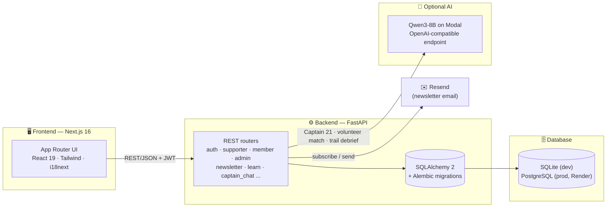

<div align="center">


</div>

# Love 21 Foundation — Digital Platform

**A full-stack platform for [Love 21 Foundation](https://love21foundation.com)** — a Hong Kong charity empowering people with Down syndrome, autism, and neurodiversity through sport, nutrition, family support, and holistic community care.

Built for the **Morgan Stanley Code to Give Hackathon** by **Team TriAble** — pairing a Next.js public site and account dashboards with a FastAPI backend for donations, volunteering, admin tools and AI features.

[CI](https://github.com/destiny-brown/MS_Hackathon_Love21/actions/workflows/ci.yml)
Next.js
React
FastAPI
Python
TypeScript
PostgreSQL


---


## Contents

- [🎯 Problem Statement](#problem-statement)
- [✨ Highlights](#highlights)
- [🏗️ Architecture](#architecture)
- [🧭 Feature map](#feature-map)
- [📁 Repository layout](#repo-layout)
- [🛠️ Tech stack](#tech-stack)
- [🚀 Quickstart](#quickstart)
- [🔑 Demo logins](#demo-logins)
- [⚙️ Configuration](#configuration)
- [☁️ Deployment](#deployment)
- [🗺️ Notable routes](#notable-routes)
- [📄 License & attribution](#license)

---


## 🎯 Problem Statement


### Love 21: Hong Kong Challenge Statement

**Context:** Love 21 Foundation empowers the Down syndrome, autistic, and neurodiverse community through sports, nutrition, and holistic support programs, offering nearly 1,000 healthy activities to support 600+ members and families each month. While their programs are deep and impactful, the current website does not convey the breadth of their work or guide supporters toward meaningful involvement. Love 21 believes that seeing ability in action, participating as a volunteer, and understanding the impact of giving are the strongest ways to build community, reduce stigma, and grow long-term support.

**Problem Statement:** How might Love 21 redesign their website to transform passive visitors into an engaged community — by celebrating ability, motivating volunteering, and making donating more meaningful?

**Our Mission:** Build a unified website that brings together three pillars:

- **Showcase Impact & Celebrate Ability**
  - Clearly communicate the depth of Love 21's programs and holistic model.
  - Highlight real accomplishments, milestones, and moments that celebrate what constituents can do — not just what services are provided.
- **Educate and Drive Volunteering**
  - Educate visitors about the neurodiverse community through shared experiences and connections.
  - Create a clear, welcoming path from curiosity to volunteer sign-up that feels rewarding, human, and easy.
- **Make Donating Engaging and Meaningful**
  - Redesign the donation experience so supporters can clearly see what their contribution supports.
  - Help donors feel acknowledged, connected, and motivated to stay involved after giving.


### The issues


| #   | Issue                                                                                                                                                                                                                                      |
| --- | ------------------------------------------------------------------------------------------------------------------------------------------------------------------------------------------------------------------------------------------ |
| 1   | The current website does not clearly communicate the depth of Love21's programs, holistic support model, or the impact the organization creates within the neurodiverse community.                                                         |
| 2   | Real accomplishments, milestones, and success stories that celebrate what the neurodiverse community can achieve are not prominently featured.                                                                                             |
| 3   | Visitors are not adequately educated about the neurodiverse community. More awareness-building content is needed to reduce ignorance, challenge stereotypes, and promote inclusion.                                                        |
| 4   | There is no clear, welcoming journey that encourages visitors to donate, volunteer, or get involved in a way that feels simple, human, and rewarding. Additionally, the current process is largely manual, creating administrative burden. |
| 5   | Donors and volunteers cannot clearly see how their contributions make a difference, making it harder for them to feel acknowledged, connected, and motivated to stay involved.                                                             |
| 6   | Volunteers lack structured engagement, recognition, and clear pathways to track their involvement, making it difficult for the organization to retain volunteers and convert them into long-term supporters.                               |
| 7   | External web operations are disconnected from internal progress, lacking traffic analytics, simple CMS tools for non-technical staff, and real-time donor acknowledgment.                                                                  |
| 8   | The current website lacks key accessibility features, including font size controls, English/Cantonese/Mandarin language options, and easy navigation features for all users.                                                               |


### Our magic solution


| #   | Solution                                                                                                                                                                                                                                                                                                                                                                 |
| --- | ------------------------------------------------------------------------------------------------------------------------------------------------------------------------------------------------------------------------------------------------------------------------------------------------------------------------------------------------------------------------ |
| 1   | Our **Get Involved** section guides visitors through sports, nutrition, family support, and CSR programmes, while the **Impact Dashboard** explains Love21's holistic care model through growth metrics and transparent reporting. The **Donate** and **Wishlist** pages also display live campaign progress so supporters can clearly see where their contributions go. |
| 2   | Our **Stories & Media** page and homepage spotlights showcase member achievements, competition medals, media coverage, and community milestones. Testimonials and story carousels throughout the site ensure these accomplishments remain visible and celebrated.                                                                                                        |
| 3   | Our **Learn** page combines **21 Moves**, an interactive educational quiz featuring Captain 21, curated articles, and videos to help visitors better understand neurodiversity, challenge stereotypes, and promote inclusion through engaging content.                                                                                                                   |
| 4   | Our **Get Involved** page, persistent **Donate** and **Volunteer** buttons, and self-service registration provide simple and intuitive ways for visitors to take action. Behind the scenes, the staff **admin console** streamlines event and activity management, reducing manual administration.                                                                       |
| 5   | Logged-in supporters can view their donations, campaign impact, volunteer hours, and event participation in a single dashboard. Members can submit thank-you messages for the **Gratitude Wall**, while our AI-powered **Captain's Corner** adds a personal touch that helps supporters feel recognised and connected.                                                   |
| 6   | Our **Volunteer** page enables users to browse opportunities, receive AI-powered role recommendations, register for activities, and track their hours through their supporter dashboard. Recognition tiers, achievement badges, and streaks from **21 Moves** encourage continued participation and long-term engagement.                                                |
| 7   | Our **Admin Console** allows staff to manage campaigns, wishlist items, events, learning content, and newsletters with AI-assisted support. Integrated **Google Analytics** and **Looker Studio** dashboards provide real-time insights, ensuring public-facing activities remain connected to internal operations.                                                      |
| 8   | We improve accessibility through a language switcher with full English, Cantonese, and Mandarin translations, an accessibility menu with font-size and contrast controls, and sticky page navigation for easier browsing. Our AI assistant can also guide visitors directly to relevant pages based on their requests.                                                   |


[↑ back to top](#toc)

## ✨ Highlights


|                                    |                                                                                                                                                               |
| ---------------------------------- | ------------------------------------------------------------------------------------------------------------------------------------------------------------- |
| 🧩 **3 account roles**             | Supporter, Member and Admin dashboards with access verified directly on the backend                                                                           |
| 🤖 **AI-native, not AI-dependent** | Captain 21 chat assistant, volunteer matching, and trail debrief — every AI feature gracefully falls back to rule-based logic when no model key is configured |
| 🌏 **Trilingual by design**        | English, Cantonese and Simplified Chinese via `react-i18next`, including AI-generated replies                                                                 |
| 🎮 **Gamified education**          | "21 Moves" — an interactive game teaching neurodiversity concepts, with AI-crafted debrief and encouragement                                                  |
| 💳 **End-to-end giving flow**      | Campaigns, causes and wishlist items share one funding-progress engine, a public gratitude wall and a mock checkout                                           |
| 🚀 **Deploy-ready out of the box** | Dockerized, CI-tested on every PR, with a Vercel + Render blueprint and a one-command Modal deploy for the AI model                                           |


> 🧑‍✈️ **Meet Captain 21** — Team TriAble's mascot and the site's AI agent. It chats and navigates visitors around the site, cheers users through the "21 Moves" game, and greets supporters on their dashboard.

[↑ back to top](#toc)

## 🏗️ Architecture




Frontend and backend are deployed independently (Vercel + Render) and talk over REST; every AI-backed router is optional and degrades to deterministic logic when `MODEL_ENABLED=false`.

[↑ back to top](#toc)

## 🧭 Feature map


| Feature                       | Frontend                                                                    | Backend                                                    | Notes                                                                              |
| ----------------------------- | --------------------------------------------------------------------------- | ---------------------------------------------------------- | ---------------------------------------------------------------------------------- |
| **Accounts & auth**           | `app/login`, `app/register`                                                 | `routers/auth.py`                                          | JWT access + refresh tokens, role-based landing redirect                           |
| **Supporter dashboard**       | `app/supporter/dashboard`                                                   | `routers/supporter.py`                                     | Giving history, volunteer hours, activity sign-ups, AI event picks                 |
| **Member dashboard**          | `app/member`                                                                | `routers/member.py`, `routers/gratitude_entries.py`        | Profile, moderated gratitude submissions                                           |
| **Admin console**             | `app/admin`, `components/admin`                                             | `routers/admin.py`, `routers/admin_learn.py`               | Activities, volunteers, gratitude moderation, newsletter, learn content, analytics |
| **Donations & wishlist**      | `app/donate`, `app/donation-form`, `app/wishlist`                           | `routers/support_opportunities.py`, `routers/supporter.py` | Shared funding-progress engine, mock checkout, gratitude wall                      |
| **Volunteering**              | `app/our-volunteer`                                                         | `admin.py`, `supporter.py`, `volunteer_match.py`           | Sign-ups, hours logging, AI-scored role matching                                   |
| **Learn & Play**              | `app/learn-play`, `learn-play/21-moves`                                     | `routers/learn.py`, `admin_learn.py`, `trail_debrief.py`   | Quizzes, videos, gamified trail, AI debrief & encouragement                        |
| **Captain 21 (AI assistant)** | `components/captain`                                                        | `routers/captain_chat.py`, `services/captain_rag.py`       | RAG-backed replies, structured `tool_calls` (navigate, set language), voice input  |
| **Newsletter**                | `app/newsletter`, homepage signup form                                      | `routers/newsletter.py`                                    | Tokenized subscribe/unsubscribe, admin preview & send via Resend                   |
| **Governance & content**      | `about-governance`, `board-of-directors`, `our-finance`, `stories`, `media` | —                                                          | Static/CMS-style informational pages                                               |
| **i18n**                      | `lib/i18n`, `locales/`                                                      | AI replies localized server-side                           | English · Cantonese (yue) · Simplified Chinese                                     |


Full feature-by-feature breakdown (files, quirks, workflow): `[FEATURES.md](FEATURES.md)`.

[↑ back to top](#toc)

## 📁 Repository layout

```
MS_Hackathon_Love21/
├── frontend/                  Next.js 16 app (Vercel root)
│   ├── app/                     ~35 pages — donate, wishlist, learn-play/21-moves,
│   │                            supporter/member dashboards, admin, governance
│   ├── components/              captain/ (AI assistant), learn/trail-map/ (21 Moves),
│   │                            admin/, dashboards, design-system ui/
│   ├── lib/                     API client, auth, i18n, AI helpers
│   └── locales/                 en / yue (Cantonese) / zh
│
├── backend/                   FastAPI service
│   ├── app/routers/              auth, supporter, member, admin, newsletter,
│   │                             support_opportunities, learn, captain_chat,
│   │                             volunteer_match, trail_debrief
│   ├── app/models/, services/    SQLAlchemy models + AI matching/RAG/newsletter logic
│   ├── migrations/               Alembic schema history
│   └── tests/                    Pytest suite
│
├── docker-compose.yml         One-command local stack (backend + frontend + db)
└── render.yaml                 Render blueprint (backend service + Postgres)
```

[↑ back to top](#toc)

## 🛠️ Tech stack


| Layer            | Stack                                                                               |
| ---------------- | ----------------------------------------------------------------------------------- |
| Frontend         | Next.js 16 (App Router), React 19, TypeScript, Tailwind CSS, Framer Motion, i18next |
| Backend          | FastAPI, SQLAlchemy 2, Alembic, JWT auth                                            |
| Database         | SQLite locally; PostgreSQL in production (Render)                                   |
| AI (optional)    | OpenAI-compatible Qwen3-8B endpoint on Modal                                        |
| Email (optional) | Resend for newsletter                                                               |


[↑ back to top](#toc)

## 🚀 Quickstart

**Prerequisites:** Python 3.11+, Node.js 20+, npm

### 1. Backend

```bash
cd backend
python3.11 -m venv .venv
source .venv/bin/activate   # Windows: .venv\Scripts\activate
pip install -r requirements.txt
cp .env.example .env
python -m scripts.migrate
python seed.py
uvicorn app.main:app --reload --host 0.0.0.0 --port 8000
```


### 2. Frontend

```bash
cd frontend
npm install
cp .env.example .env.local
npm run dev
```


|               |                                                              |
| ------------- | ------------------------------------------------------------ |
| 🌐 Frontend   | [http://localhost:3000](http://localhost:3000)               |
| ❤️ API health | [http://localhost:8000/health](http://localhost:8000/health) |
| 📚 API docs   | [http://localhost:8000/docs](http://localhost:8000/docs)     |


### Or, with Docker

```bash
cp backend/.env.example backend/.env
docker compose up --build
```

Migrations and seed data run automatically on backend startup.

[↑ back to top](#toc)

## 🔑 Demo logins

All demo users share the password `demo1234`:


| Role      | Email                   |
| --------- | ----------------------- |
| Admin     | `admin@love21.demo`     |
| Member    | `member@love21.demo`    |
| Supporter | `supporter@love21.demo` |


Legacy `donor@` / `volunteer@` demo rows are migrated to the **supporter** role on startup when present. Override the bootstrap admin with `BOOTSTRAP_ADMIN_EMAIL` / `BOOTSTRAP_ADMIN_PASSWORD` in `backend/.env`.

[↑ back to top](#toc)

## ⚙️ Configuration

**Backend —** `backend/.env`


| Variable                | Purpose                                       |
| ----------------------- | --------------------------------------------- |
| `DATABASE_URL`          | SQLite or Postgres connection string          |
| `SECRET_KEY`            | JWT signing secret — change before production |
| `CORS_ORIGINS`          | Comma-separated frontend origins              |
| `SITE_URL`              | Public site URL (links in emails)             |
| `MODEL_ENABLED`         | `true` to enable AI features                  |
| `MODEL_BASE_URL`        | OpenAI-compatible model base URL + `/v1`      |
| `MODEL_API_KEY`         | Bearer token for the model server             |
| `MODEL_NAME`            | Model id (e.g. `qwen3-8b`)                    |
| `RESEND_API_KEY`        | Newsletter sending (optional)                 |
| `NEWSLETTER_FROM_EMAIL` | From address for newsletter                   |


See `backend/.env.example` for defaults.


**Frontend —** `frontend/.env.local`


| Variable              | Purpose                                    |
| --------------------- | ------------------------------------------ |
| `NEXT_PUBLIC_API_URL` | Backend URL (e.g. `http://localhost:8000`) |
| `SITE_URL`            | Used by server routes such as newsletter   |


[↑ back to top](#toc)

## ☁️ Deployment

CI runs backend tests, migration checks, and a production frontend build on every push/PR to `main`.

**Frontend — Vercel**

1. Import the repo; set **root directory** to `frontend`.
2. Set `NEXT_PUBLIC_API_URL` to your deployed backend URL.
3. Deploy.

**Backend — Render**

1. Create a Blueprint from `render.yaml` (Docker service + Postgres).
2. Set `CORS_ORIGINS` to your Vercel origin.
3. Set `MODEL_BASE_URL` / `MODEL_API_KEY` if using AI.

Migrations run automatically before Uvicorn starts (`python -m scripts.migrate`).

**AI model — Modal (optional)**

```bash
pip install modal
python3 -m modal setup
python3 -m modal secret create love21-model MODEL_API_KEY=<your-token>
cd backend
python3 -m modal deploy modal_llm.py
```

Set `MODEL_BASE_URL` to the deployed Modal URL with `/v1` appended, and use the same token for `MODEL_API_KEY`.

[↑ back to top](#toc)

## 🗺️ Notable routes


| Path                   | Description                                               |
| ---------------------- | --------------------------------------------------------- |
| `/donate`              | Donation marketing page, tiers, gratitude wall, campaigns |
| `/donation-form`       | Mock checkout (wishlist / campaign / cause)               |
| `/wishlist`            | In-kind needs                                             |
| `/learn-play`          | Education hub                                             |
| `/learn-play/21-moves` | Interactive trail game                                    |
| `/our-volunteer`       | Volunteer onboarding                                      |
| `/supporter/dashboard` | Supporter account                                         |
| `/member/dashboard`    | Member account                                            |
| `/admin`               | Staff admin shell                                         |


**Auth model, demo-data disclaimer & troubleshooting**

**Auth**

- Short-lived JWT access tokens + refresh tokens (defaults: 60 min / 7 days).
- Tokens are stored in `localStorage` in this demo build — convenient for hackathon development; consider HttpOnly cookies for production hardening.
- Role checks are enforced on the server via `require_roles(...)`.

**Demo content**
Seeded campaigns, wishlist targets, activities, donation history, volunteer hours, and placeholder images are **demonstration data**. Love 21 should verify and replace them before any production launch. Mock donations do not process real payments.

**401 in the browser but login works in API docs**

- Clear `localStorage` keys for the site on `localhost:3000`.
- Confirm `NEXT_PUBLIC_API_URL` points at the running backend.
- Restart both dev servers.

**Gratitude / opportunities empty**

- Ensure the backend is running and seeded (`python seed.py`).
- Check `/support-opportunities` and `/gratitude-entries/public` in the API docs.

**AI features unavailable**

- Set `MODEL_ENABLED=true` and valid `MODEL_BASE_URL` / `MODEL_API_KEY`.
- First request after Modal idle time may be slow while the model cold-starts.


[↑ back to top](#toc)

## 📄 License & attribution

Built for **Love 21 Foundation** as part of the **Morgan Stanley Code to Give Hackathon**. Charity registration and official branding belong to Love 21 Foundation Limited.