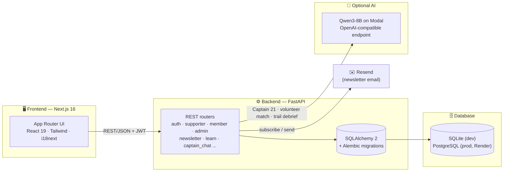

<div align="center">


# Love 21 Foundation — Digital Platform

**A full-stack platform for [Love 21 Foundation](https://love21foundation.com)** — a Hong Kong charity empowering people with Down syndrome, autism, and neurodiversity through sport, nutrition, family support, and holistic community care.

Built for the **Morgan Stanley Code to Give Hackathon** — pairing a Next.js public site and account dashboards with a FastAPI backend for donations, volunteering, admin tools, and optional AI features.

[](https://github.com/destiny-brown/MS_Hackathon_Love21/actions/workflows/ci.yml)


</div>

---

## <a name="toc"></a>Contents

- [✨ Highlights](#highlights)
- [🏗️ Architecture](#architecture)
- [🧭 Feature map](#feature-map)
- [📁 Repository layout](#repo-layout)
- [🛠️ Tech stack](#tech-stack)
- [🚀 Quickstart](#quickstart)
- [🔑 Demo logins](#demo-logins)
- [⚙️ Configuration](#configuration)
- [☁️ Deployment](#deployment)
- [🗺️ Notable routes](#notable-routes)
- [📄 License & attribution](#license)

---

## <a name="highlights"></a>✨ Highlights

| | |
|---|---|
| 🧩 **3 account roles** | Supporter, Member, and Admin dashboards, each with server-enforced role checks |
| 🤖 **AI-native, not AI-dependent** | Captain 21 chat assistant, volunteer matching, and trail debrief — every AI feature gracefully falls back to rule-based logic when no model key is configured |
| 🌏 **Trilingual by design** | English, Cantonese (yue), and Simplified Chinese via `react-i18next`, including AI-generated replies |
| 🎮 **Gamified education** | "21 Moves" — an interactive trail teaching neurodiversity concepts, with AI-crafted debrief and encouragement |
| 💳 **End-to-end giving flow** | Campaigns, causes, and wishlist items share one funding-progress engine, a public gratitude wall, and a mock checkout |
| 🚀 **Deploy-ready out of the box** | Dockerized, CI-tested on every PR, with a Vercel + Render blueprint and a one-command Modal deploy for the AI model |

[↑ back to top](#toc)

## <a name="architecture"></a>🏗️ Architecture



Frontend and backend are deployed independently (Vercel + Render) and talk over REST; every AI-backed router is optional and degrades to deterministic logic when `MODEL_ENABLED=false`.

[↑ back to top](#toc)

## <a name="feature-map"></a>🧭 Feature map

| Feature | Frontend | Backend | Notes |
|---|---|---|---|
| **Accounts & auth** | `app/login`, `app/register` | `routers/auth.py` | JWT access + refresh tokens, role-based landing redirect |
| **Supporter dashboard** | `app/supporter/dashboard` | `routers/supporter.py` | Giving history, volunteer hours, activity sign-ups, AI event picks |
| **Member dashboard** | `app/member` | `routers/member.py`, `routers/gratitude_entries.py` | Profile, moderated gratitude submissions |
| **Admin console** | `app/admin`, `components/admin` | `routers/admin.py`, `routers/admin_learn.py` | Activities, volunteers, gratitude moderation, newsletter, learn content, analytics |
| **Donations & wishlist** | `app/donate`, `app/donation-form`, `app/wishlist` | `routers/support_opportunities.py`, `routers/supporter.py` | Shared funding-progress engine, mock checkout, gratitude wall |
| **Volunteering** | `app/our-volunteer` | `admin.py`, `supporter.py`, `volunteer_match.py` | Sign-ups, hours logging, AI-scored role matching |
| **Learn & Play** | `app/learn-play`, `learn-play/21-moves` | `routers/learn.py`, `admin_learn.py`, `trail_debrief.py` | Quizzes, videos, gamified trail, AI debrief & encouragement |
| **Captain 21 (AI assistant)** | `components/captain` | `routers/captain_chat.py`, `services/captain_rag.py` | RAG-backed replies, structured `tool_calls` (navigate, set language), voice input |
| **Newsletter** | `app/newsletter`, homepage signup form | `routers/newsletter.py` | Tokenized subscribe/unsubscribe, admin preview & send via Resend |
| **Governance & content** | `about-governance`, `board-of-directors`, `our-finance`, `stories`, `media` | — | Static/CMS-style informational pages |
| **i18n** | `lib/i18n`, `locales/` | AI replies localized server-side | English · Cantonese (yue) · Simplified Chinese |

Full feature-by-feature breakdown (files, quirks, workflow): [`FEATURES.md`](FEATURES.md).

[↑ back to top](#toc)

## <a name="repo-layout"></a>📁 Repository layout

```
MS_Hackathon_Love21/
├── frontend/                      Next.js 16 app (App Router) · Vercel root directory
│   ├── app/                        ~35 routed pages
│   │   ├── page.tsx                  Home — hero video, impact stats, story carousel
│   │   ├── donate/                   Donation marketing, tiers, gratitude wall, campaigns
│   │   ├── donation-form/            Mock checkout (wishlist / campaign / cause)
│   │   ├── wishlist/                 In-kind wishlist marketplace
│   │   ├── learn-play/               Neurodiversity education hub
│   │   │   └── 21-moves/               Gamified interactive learning trail
│   │   ├── get-involved/, our-volunteer/   Volunteer onboarding & support pathways
│   │   ├── supporter/dashboard/      Supporter account (giving, hours, AI picks)
│   │   ├── member/                   Member profile & gratitude submissions
│   │   ├── admin/                    Staff admin shell
│   │   ├── stories/, media/, traffic/    Community stories, press, live site analytics
│   │   ├── about-governance/, board-of-directors/, our-finance/   Governance & transparency
│   │   ├── login/, register/         Auth flows
│   │   └── api/                      Next.js route handlers (e.g. newsletter proxy)
│   ├── components/
│   │   ├── captain/                    Captain 21 AI widget & tool-call provider
│   │   ├── learn/trail-map/            21 Moves trail engine (scenes, unlocks, debrief panel)
│   │   ├── admin/                      Admin panel widgets
│   │   ├── supporter/, member/         Dashboard-specific UI
│   │   ├── site/, layouts/, brand/     Header, footer, nav shell, floating CTAs
│   │   └── ui/                         Design-system primitives (Radix-based)
│   ├── lib/                         API client, auth, i18n, Captain logic, static content/seed data
│   └── locales/                     en / yue (Cantonese) / zh translation JSON
│
├── backend/                        FastAPI service
│   ├── app/
│   │   ├── routers/                  auth · supporter · member · admin · admin_learn
│   │   │                             newsletter · support_opportunities · gratitude_entries
│   │   │                             learn · captain_chat · volunteer_match · trail_debrief
│   │   ├── models/                   users, donations, activities, opportunities,
│   │   │                             gratitude entries, newsletter, learn content
│   │   ├── services/                 AI matching, RAG, newsletter render/send, seeders
│   │   ├── schemas/                  Pydantic request/response contracts
│   │   ├── core/                     Settings & JWT security
│   │   └── data/                     Captain 21 knowledge base + static seed content
│   ├── migrations/                  Alembic schema history
│   ├── tests/                       Pytest suite (auth, matching, newsletter, chat, …)
│   ├── seed.py                      Demo data generator (Faker)
│   └── modal_llm.py                 Modal deployment entrypoint for the AI model
│
├── docs/examples/                  Sample rendered output (e.g. newsletter HTML)
├── .github/workflows/ci.yml        Backend tests + migration check + frontend build
├── docker-compose.yml               One-command local stack (backend + frontend + db)
└── render.yaml                      Render blueprint (backend service + Postgres)
```

[↑ back to top](#toc)

## <a name="tech-stack"></a>🛠️ Tech stack

| Layer | Stack |
|--------|--------|
| Frontend | Next.js 16 (App Router), React 19, TypeScript, Tailwind CSS, Framer Motion, i18next |
| Backend | FastAPI, SQLAlchemy 2, Alembic, JWT auth |
| Database | SQLite locally; PostgreSQL in production (Render) |
| AI (optional) | OpenAI-compatible Qwen3-8B endpoint on Modal |
| Email (optional) | Resend for newsletter |

[↑ back to top](#toc)

## <a name="quickstart"></a>🚀 Quickstart

**Prerequisites:** Python 3.11+, Node.js 20+, npm

### 1. Backend

```bash
cd backend
python3.11 -m venv .venv
source .venv/bin/activate   # Windows: .venv\Scripts\activate
pip install -r requirements.txt
cp .env.example .env
python -m scripts.migrate
python seed.py
uvicorn app.main:app --reload --host 0.0.0.0 --port 8000
```

### 2. Frontend

```bash
cd frontend
npm install
cp .env.example .env.local
npm run dev
```

| | |
|---|---|
| 🌐 Frontend | http://localhost:3000 |
| ❤️ API health | http://localhost:8000/health |
| 📚 API docs | http://localhost:8000/docs |

### Or, with Docker

```bash
cp backend/.env.example backend/.env
docker compose up --build
```

Migrations and seed data run automatically on backend startup.

[↑ back to top](#toc)

## <a name="demo-logins"></a>🔑 Demo logins

All demo users share the password **`demo1234`**:

| Role | Email |
|------|--------|
| Admin | `admin@love21.demo` |
| Member | `member@love21.demo` |
| Supporter | `supporter@love21.demo` |

Legacy `donor@` / `volunteer@` demo rows are migrated to the **supporter** role on startup when present. Override the bootstrap admin with `BOOTSTRAP_ADMIN_EMAIL` / `BOOTSTRAP_ADMIN_PASSWORD` in `backend/.env`.

[↑ back to top](#toc)

## <a name="configuration"></a>⚙️ Configuration

<details>
<summary><strong>Backend — <code>backend/.env</code></strong></summary>

| Variable | Purpose |
|----------|---------|
| `DATABASE_URL` | SQLite or Postgres connection string |
| `SECRET_KEY` | JWT signing secret — change before production |
| `CORS_ORIGINS` | Comma-separated frontend origins |
| `SITE_URL` | Public site URL (links in emails) |
| `MODEL_ENABLED` | `true` to enable AI features |
| `MODEL_BASE_URL` | OpenAI-compatible model base URL + `/v1` |
| `MODEL_API_KEY` | Bearer token for the model server |
| `MODEL_NAME` | Model id (e.g. `qwen3-8b`) |
| `RESEND_API_KEY` | Newsletter sending (optional) |
| `NEWSLETTER_FROM_EMAIL` | From address for newsletter |

See `backend/.env.example` for defaults.

</details>

<details>
<summary><strong>Frontend — <code>frontend/.env.local</code></strong></summary>

| Variable | Purpose |
|----------|---------|
| `NEXT_PUBLIC_API_URL` | Backend URL (e.g. `http://localhost:8000`) |
| `SITE_URL` | Used by server routes such as newsletter |

</details>

[↑ back to top](#toc)

## <a name="deployment"></a>☁️ Deployment

CI runs backend tests, migration checks, and a production frontend build on every push/PR to `main`.

**Frontend — Vercel**
1. Import the repo; set **root directory** to `frontend`.
2. Set `NEXT_PUBLIC_API_URL` to your deployed backend URL.
3. Deploy.

**Backend — Render**
1. Create a Blueprint from `render.yaml` (Docker service + Postgres).
2. Set `CORS_ORIGINS` to your Vercel origin.
3. Set `MODEL_BASE_URL` / `MODEL_API_KEY` if using AI.

Migrations run automatically before Uvicorn starts (`python -m scripts.migrate`).

**AI model — Modal (optional)**

```bash
pip install modal
python3 -m modal setup
python3 -m modal secret create love21-model MODEL_API_KEY=<your-token>
cd backend
python3 -m modal deploy modal_llm.py
```

Set `MODEL_BASE_URL` to the deployed Modal URL with `/v1` appended, and use the same token for `MODEL_API_KEY`.

[↑ back to top](#toc)

## <a name="notable-routes"></a>🗺️ Notable routes

| Path | Description |
|------|-------------|
| `/donate` | Donation marketing page, tiers, gratitude wall, campaigns |
| `/donation-form` | Mock checkout (wishlist / campaign / cause) |
| `/wishlist` | In-kind needs |
| `/learn-play` | Education hub |
| `/learn-play/21-moves` | Interactive trail game |
| `/our-volunteer` | Volunteer onboarding |
| `/supporter/dashboard` | Supporter account |
| `/member/dashboard` | Member account |
| `/admin` | Staff admin shell |

<details>
<summary><strong>Auth model, demo-data disclaimer & troubleshooting</strong></summary>

**Auth**
- Short-lived JWT access tokens + refresh tokens (defaults: 60 min / 7 days).
- Tokens are stored in `localStorage` in this demo build — convenient for hackathon development; consider HttpOnly cookies for production hardening.
- Role checks are enforced on the server via `require_roles(...)`.

**Demo content**
Seeded campaigns, wishlist targets, activities, donation history, volunteer hours, and placeholder images are **demonstration data**. Love 21 should verify and replace them before any production launch. Mock donations do not process real payments.

**401 in the browser but login works in API docs**
- Clear `localStorage` keys for the site on `localhost:3000`.
- Confirm `NEXT_PUBLIC_API_URL` points at the running backend.
- Restart both dev servers.

**Gratitude / opportunities empty**
- Ensure the backend is running and seeded (`python seed.py`).
- Check `/support-opportunities` and `/gratitude-entries/public` in the API docs.

**AI features unavailable**
- Set `MODEL_ENABLED=true` and valid `MODEL_BASE_URL` / `MODEL_API_KEY`.
- First request after Modal idle time may be slow while the model cold-starts.

</details>

[↑ back to top](#toc)

## <a name="license"></a>📄 License & attribution

Built for **Love 21 Foundation** as part of the **Morgan Stanley Code to Give Hackathon**. Charity registration and official branding belong to Love 21 Foundation Limited.
